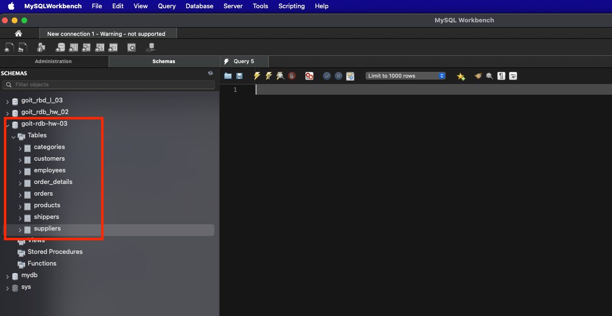
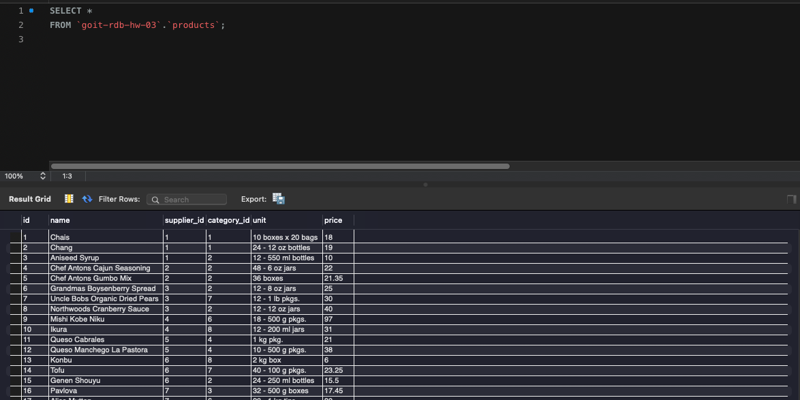
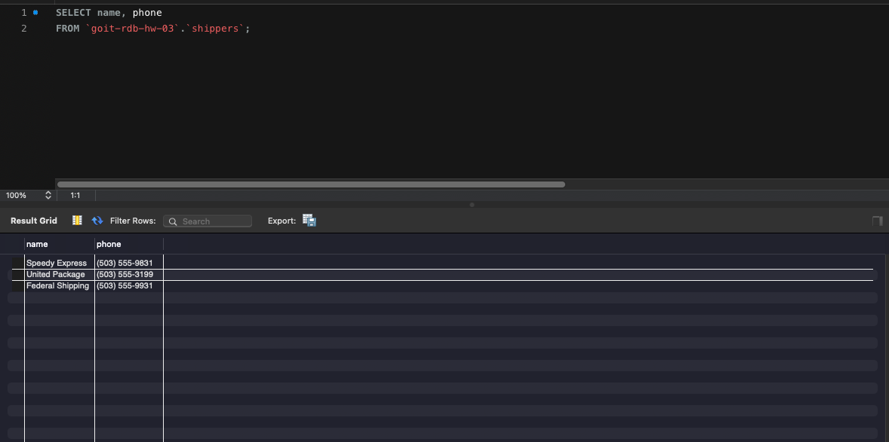
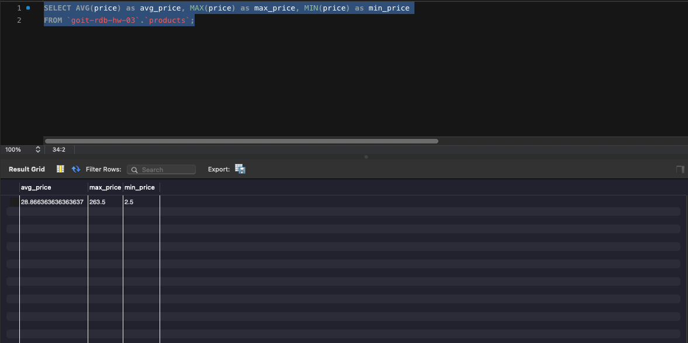
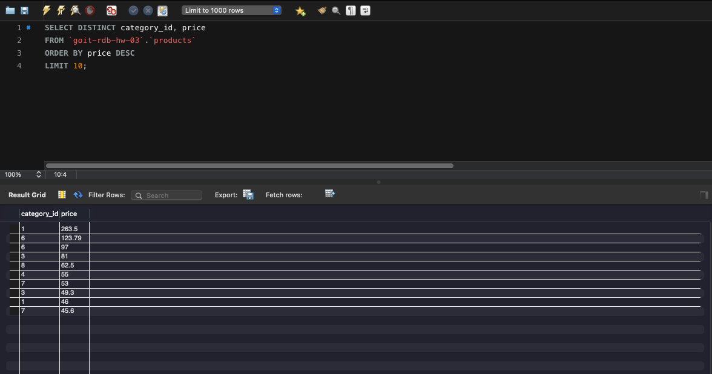
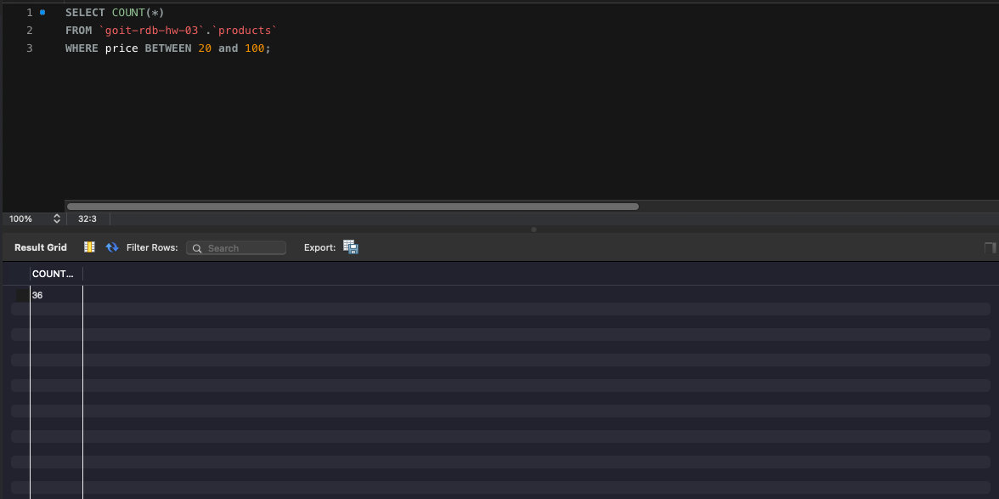
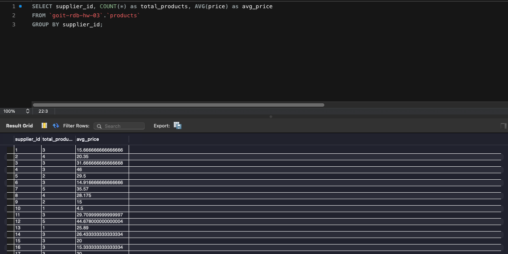

# Requirements

1. Створіть публічний репозиторій goit-rdb-hw-03 - ✅ 
2. Якщо раніше ви не завантажували [цей](https://drive.google.com/file/d/1B45tkzH3lIrf2CmQIB2VB0AJRB9Ly7c2/view) архів з даними у форматі “csv”, зробіть це зараз - ✅

# Імпортування даних

# 1.1 Вибрати всі стовпчики (За допомогою wildcard “*”) з таблиці products;

# 1.2 Вибрати тільки стовпчики name, phone з таблиці shippers;

# 2 Написати SQL команду, за допомогою якої можна знайти середнє, максимальне та мінімальне значення стовпчика price таблички products;

# 3 Написати SQL команду, за допомогою якої можна обрати унікальні значення колонок category_id та price таблиці products;

# 4 Написати SQL команду, за допомогою якої можна знайти кількість продуктів (рядків), які знаходиться в цінових межах від 20 до 100;

# 5 Написати SQL команду, за допомогою якої можна знайти кількість продуктів (рядків) та середню ціну (price) у кожного постачальника (supplier_id)
